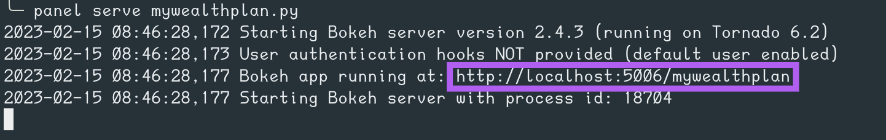

# MyWealthPlan Portfolio Selection Tool

The Portfolio Selection Tool is a dashboard application designed to determine a user's risk tolerance for investments, and based upon that tolerance present them with information on one of 5 preselected portfolios who's asset weightings align with the user's risk tolerance.  

After being matched to a portfolio, the user can navigate between 3 informational tabs to find details related to their portfolio, including asset category weights, historical performance and potential future performance.


---

## Technologies

The Portfolio Selection Tool is written in Python and uses the [Panel](https://panel.holoviz.org/index.html) dashboarding solution to present information to the user. 

Visualizations are provided by the [Bokeh](https://bokeh.org), [hvPlot](https://hvplot.holoviz.org) and [Matplotlib](https://matplotlib.org) libraries. 

Details on asset performance are retrieved using the [Yahoo Finance](https://finance.yahoo.com) API.

The [Pandas](https://pandas.pydata.org) and [Numpy](https://numpy.org) libraries are used to work with the asset data retrieved from the API.


---

## Installation Guide

### Environment Preperation

The contents of the repository should be placed into the desired folder on the users computer, being sure to maintain the directory structure. 

The following python packages must be installed to run the application locally:
* pandas
* panel
* bokeh
* matplotlib
* yahoo_fin
* numpy
* hvplot
* jupyterlab (only if the .ipynb file is used. running the .py file does not require jupyterlab)

These packages may be individually installed into the environment of your choice or you may create a new conda environment using the included environment.yml file. 

```
conda env create -f environment.yml
```

If you prefer using pip, the included requirements.txt file may be used to install the required packages.

```
pip install -r requirements.txt
```

### Create csv Files
Once you have extracted all files to your desired directory you will need to run the included create_data_file.py script in order to create the csv files used during the Monte Carlo simulations. Since the 5 portfolios currently have a fixed asses composition the data for the Monte Carlo simulations is prepared in advance and stored as csv files in the 'data' directory. The script will prepare 25 total csv files: 5 year, 10 year, 15 year, 20 year and 25 year Monte Carlo simulations for each of the 5 portfolios.

The script may be run from the command line and no arguments are taken:
```
python create_data_file.py
```

### Updating Data

You may rerun the create_data_file.py script from time to time to include the most up-to-date market information for the portfolios in order to ensure the Monte Carlo simulations are using relevant data.

---

## Launching

The Portfolio Selection Tool can be run from the jupyter notebook or by using the included python script. In either case, once launched a [Panel](https://panel.holoviz.org/index.html) dashboard will be displayed.

To run the included python script (mywealthplan.py issue the following command after switching to the correct python environment:

```
panel serve mywealthplan.py
```
This will initiate a local server. Please review the output for the server address, which may then be accessed using the browser of your choice.




To run the jupyter notebook (mywealthplan.ipynb) begin by launching jupyter lab in the correct python environment:

```
jupyter lab
```

After Jupyter Lab is running, open the mywealthplan.ipynb file from the sidebar and then use Run > Run All Cells from the menu.


---

## Usage


The left-hand portion of the dashboard consists of a six-question risk tolerance questionnaire. Once the questions are answered and the submit button is clicked the a risk tolerance score will be calculated for the user and they will be assigned a risk tolerance category. 


Once determined, the risk tolerance category is used to assign the user to one of five predetermined portfolios that vary in their overall level of investment risk. Details on the assigned portfolio are provided in the tabs found in the upper-right-hand portion of the dashboard. The following information will presented to the user:


Then the client can go to the 'Past Performance' tab where a deeper analysis of past performance and Benchmark vs Market are provided for their chosen portfolio:


Finally, on the last tab, a 10 years Monte Carlo Simulation can be launched in order to get a lower and upper range for the expected performance with a 95% confidence interval:


---

## Contributors

An initial version of the MyWealthPlan Portfolio Selection Tool was developed to fulfill a project requirement for the UC Berkeley Extension FinTech bootcamp. The original contributors were:

[Ahmad Takatkah](https://github.com/vcpreneur)  
[Lourdes Dominguez Begoa](https://github.com/LourdesDB)  
[Patricio Gomez](https://github.com/patogogo)  
[Lovedeep Singh](https://github.com/LovedeepSingh89)  
[Thomas L. Champion](https://github.com/tlchampion)  

A GitHub repo for the original code can be found [here](https://github.com/tlchampion/personal_financial_advisor)


---

## Live App

A copy of this application has been pushed to Heroku and can be viewed [here](mwpapp.herokuapp.com)

Please be aware that the app is set to sleep if not accessed within 30 minutes. As such, there may be a short delay as the app wakes up.

---

## License

License information can be found in the included LICENSE file.

---

## Credits
* Risk Analysis Survey was compiled based upon a survey provided by [Lincoln Financial Group](https://bit.ly/3InwBMP)
* Code for generating the Monte Carlo Simulation was modified from code provided by UC Berkeley Extension FinTech Bootcamp

___

## Future Work

Future work and/or enhancements to this project include:
* Implementing a more robust Risk Analysis Survey
* Adding in features to allow a user to fine-tuning their portfolio
* Leveraging a Machine Learning algorithm to optimize and further customize portfolios
* Adding market information for the client
* Improve visualizations
* Enhance UI/UX


---

## Disclaimer

The information provided through this application is for information and educational purposes only. 
It is not intended to be, nor should it be used as, investment advice. 
Seek a duly licensed professional for investment advice.


