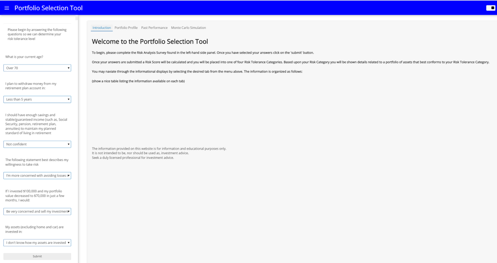
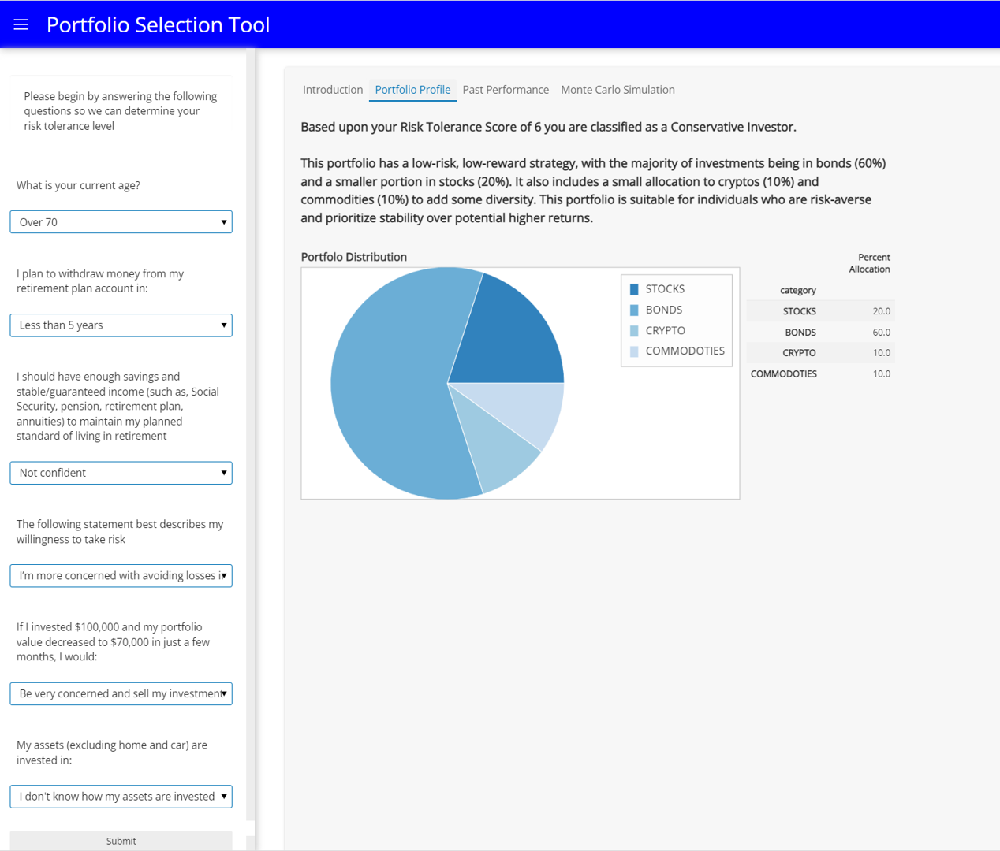
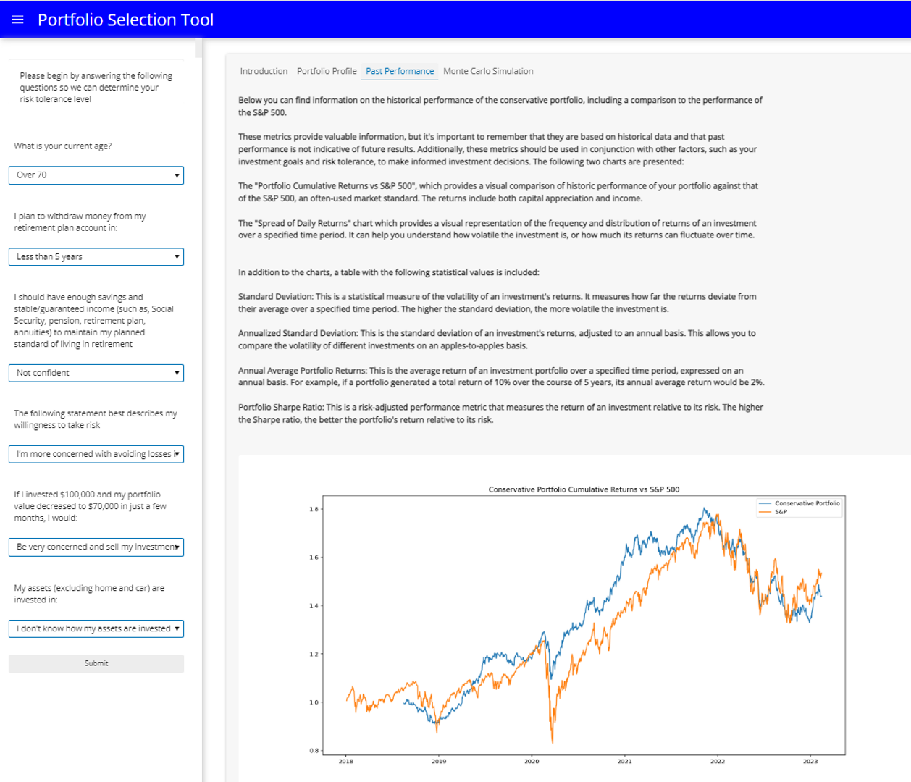
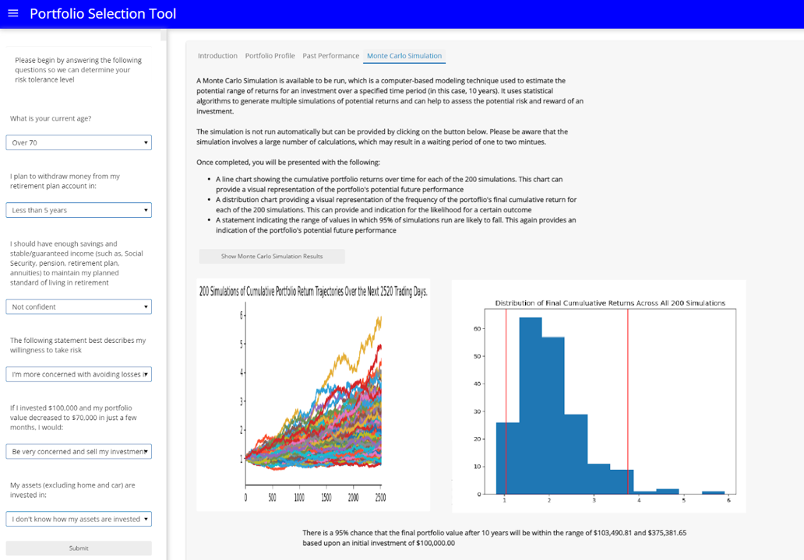

# Portfolio Selection Tool

The Portfolio Selection Tool is a web application designed to determine a user's risk tolerance for investments, and based upon that tolerance present them with information on one of 5 preselected portfolios who's asset weightings align with the user's risk tolerance.  

---

## Technologies

The Portfolio Selection Tool is written in Python and uses the [Panel](https://panel.holoviz.org/index.html) dashboarding solution to present information to the user. 

Visualizations are provided by the [Bokeh](https://bokeh.org) and [Matplotlib](https://matplotlib.org) libraries. 

Details on asset performance are retrieved using the [Yahoo Finance](https://finance.yahoo.com) API.

The [Pandas](https://pandas.pydata.org) library is used to work with the asset data retrieved from the API.

---

## Installation Guide

The contents of the repository should be placed into the desired folder on the users computer, being sure to maintain the directory structure. 

The following python packages must be installed to run the application locally:
* pandas
* panel
* bokeh
* matplotlib
* yahoo_fin
* numpy

These packages may be individually installed into the environment of your choice or you may create a new conda environment using the included environment.yml file. If you prefer using pip, the included requirements.txt file may be used.

---

## Usage

The Portfolio Selection Tool can be run from the jupyter notebook or by using the included python script. In either case, once launched a new browser tab will be opened displaying a [Panel](https://panel.holoviz.org/index.html) dashboard.

The left-hand portion of the dashboard consists of a six-question risk tolerance questionnaire. Once the questions are answered and the submit button is clicked the a risk tolerance score will be calculated for the user and they will be assigned a risk tolerance category. 

Once determined, the risk tolerance category is used to assign the user to one of five predetermined portfolios that vary in their overall level of investment risk. Details on the assigned portfolio are provided in the tabs found in the upper-right-hand portion of the dashboard. The following information will presented to the user:

Then the client can go to the 'Past Performance' tab where a deeper analysis of past performance and Benchmark vs Market are provided for their chosen portfolio:

Finally, on the last tab, a 10 years Monte Carlo Simulation can be launched in order to get a lower and upper range for the expected performance with a 95% confidence interval:

---

## Contributors

[Ahmad Takatkah](https://github.com/vcpreneur)
[Lourdes Dominguez Begoa](https://github.com/LourdesDB)
[Patricio Gomez](https://github.com/patogogo)
[Lovedeep Singh](https://github.com/LovedeepSingh89)
[Thomas L. Champion](https://github.com/tlchampion)

---

## License

License information can be found in the included LICENSE file.

---
## Credits
* Risk Analysis Survey was compiled based upon a survey provided by [Lincoln Financial Group](https://bit.ly/3InwBMP)
* Code for generating the Monte Carlo Simulation was modified from code provided by UC Berkeley Extension FinTech Bootcamp

___
## Future Work

Future work and/or enhancements to this project include:
* Implementing a more robust Risk Analysis Survey
* Adding in features to allow a user to fine-tuning their portfolio
* Leveraging a Machine Learning algorithm to optimize and further customize portfolios
* Adding Market Information for the Client
* Improve visualizations and UX

---

## Disclaimer

The information provided through this application is for information and educational purposes only. 
It is not intended to be, nor should it be used as, investment advice. 
Seek a duly licensed professional for investment advice.

